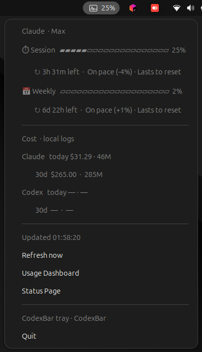

# codexbar-linux-tray

[](https://github.com/tusharlanger/codexbar-linux-tray/actions/workflows/ci.yml)
[](https://github.com/tusharlanger/codexbar-linux-tray/releases)
[](LICENSE)
[](https://www.python.org/)
[](https://github.com/ubuntu/gnome-shell-extension-appindicator)

A tiny GNOME / Linux AppIndicator that puts your **Claude** and **Codex** usage right into the top bar — session %, weekly %, Sonnet sub-meter, monthly extras, reset countdowns, pace, and local cost (today / 30d).

It's the menu-bar UX that [`steipete/CodexBar`](https://github.com/steipete/CodexBar) ships on macOS, brought to Linux by reusing CodexBar's official Linux CLI binary as the data source.

> **All data work is done by the upstream `codexbar` CLI from [steipete/CodexBar](https://github.com/steipete/CodexBar). This project is just a thin GTK / AppIndicator front-end for Linux desktops.**

---

## Screenshot



Top bar label: `S<sessionPct>%` (icon turns yellow at 60%, red at 85%). Click to open the dropdown — equivalent fields to the macOS app's Claude card.

## Why?

The upstream macOS app is great. On Linux you can already run `codexbar` from a terminal — but if you live in Claude Code / Codex CLI all day, you want the same glanceable signal in the system tray. This project bridges the gap.

## Install

### Prereqs

- **codexbar CLI** from the upstream releases:
  ```bash
  curl -L -o /tmp/codexbar.tgz \
    https://github.com/steipete/CodexBar/releases/latest/download/CodexBarCLI-linux-x86_64.tar.gz
  mkdir -p ~/.local/bin
  tar -xzf /tmp/codexbar.tgz -C ~/.local/bin
  ```
  (Use the `aarch64` tarball on ARM.)
- **Python AppIndicator bindings**:
  - Ubuntu / Debian: `sudo apt install -y gir1.2-ayatanaappindicator3-0.1 python3-gi`
  - Fedora: `sudo dnf install -y libayatana-appindicator-gtk3 python3-gobject`
  - Arch: `sudo pacman -S libayatana-appindicator python-gobject`
- **GNOME AppIndicator extension** (preinstalled on Ubuntu; on Fedora/Arch enable “AppIndicator and KStatusNotifierItem Support” from extensions.gnome.org).

### Install this tray

```bash
git clone https://github.com/tusharlanger/codexbar-linux-tray.git
cd codexbar-linux-tray
./install.sh
```

The installer copies `codexbar-tray.py` to `~/.local/bin/`, then either registers a **systemd user service** (preferred) or drops a GNOME `autostart/.desktop` file. The tray launches immediately and on every login.

### Manage

```bash
systemctl --user status codexbar-tray
systemctl --user restart codexbar-tray
systemctl --user stop codexbar-tray
journalctl --user -u codexbar-tray -f
```

## Configure

Tweak the constants at the top of `codexbar-tray.py`:

| Constant | Default | Meaning |
|---|---|---|
| `REFRESH_SECONDS` | `120` | Refresh cadence (seconds). |
| `THRESHOLD_WARN_PCT` | `60` | Icon turns yellow when session/weekly hits this. |
| `THRESHOLD_CRIT_PCT` | `85` | Icon turns red. |
| `BAR_WIDTH` | `20` | Progress-bar character width. |

After edits: `systemctl --user restart codexbar-tray`.

## How it works

- Polls `codexbar usage --provider claude --source oauth --json` for session / weekly / Sonnet / extras.
- Polls `codexbar cost --provider {claude,codex} --json` for local-log cost.
- Renders into a `Gtk.Menu` attached to a `AyatanaAppIndicator3` indicator with Pango markup for color/weight.
- Pace = `usedPercent − elapsedPercentOfWindow`. Negative → behind, positive → ahead. Projects whether you'll exhaust before reset.

No data leaves your machine. All API/CLI work is done by the upstream `codexbar` binary.

## Limitations on Linux

These are upstream `codexbar` constraints, not this project's:

- **Codex usage** (session %, weekly %) requires the `@openai/codex` CLI. Codex cost from local logs always works.
- **Web-source providers** (Cursor dashboard, Claude web cookies, etc.) are macOS-only in the upstream binary.
- The Claude OAuth source works on Linux as long as the `claude` CLI has signed in once and stored credentials.

## Credits

- **[steipete/CodexBar](https://github.com/steipete/CodexBar)** by [Peter Steinberger](https://twitter.com/steipete) — the upstream macOS menu-bar app and the Linux CLI binary this tray wraps. License: MIT.
- **[ccusage](https://github.com/ryoppippi/ccusage)** by ryoppippi — original inspiration for local cost tracking, credited by upstream CodexBar. License: MIT.
- **AyatanaAppIndicator3** — system tray on modern Linux desktops.
- **GNOME AppIndicator extension** by the Ubuntu and AppIndicator-extension contributors.

## Contributing

PRs welcome — especially for KDE Plasma support, Wayland-only desktops, more providers in the dropdown, or a real GTK4 popover instead of `Gtk.Menu`. File an issue if a provider you use isn't represented.

## License

MIT — see [LICENSE](LICENSE).
